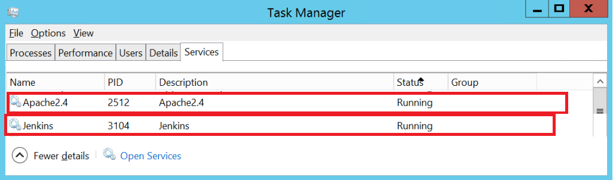

# Jenkins + Apache + https on Windows #

This repo stores some important Jenkins related configs for achieving SSL grading A.

**Current setup**
- Jenkins is running at localhost:8080 on a server (e.g. named ci.example.com).
- Apache enables https://ci.example.com (443) and has reverse proxy to localhost:8080.
- Apache redirects http://ci.example.com (80) to https.
 

## Install Apache on Windows

**Install Apache**

1. Download and install the latest C++ Redistributable Visual Studio 2015: 
[vc_redist_x86.exe](https://www.microsoft.com/en-us/download/details.aspx?id=53840).
1. Download and install Apache 2.4.25 Win32 (httpd-2.4.25-win32-VC14.zip) from 
[apache-lounge](https://www.apachelounge.com/download/) 
(note that official Apache site does not provide binaries for Windows installation).
1. Unzip `httpd-2.4.25-win32-VC14.zip` and move it to `C:\Apache24\`
1. `cd C:\Apache24\bin`
1. Run: `httpd -k install`

(see also [Manual_install_on_Windows_7_with_Apache](https://docs.moodle.org/29/en/Manual_install_on_Windows_7_with_Apache_and_MySQL))

**Update related Apache configs**

1. Edit: C:\Apache24\conf\httpd.conf  (see [httpd.conf](C_Apache24/conf/httpd.conf))
1. Edit: C:\Apache24\conf\extra\httpd-vhosts.conf (see [httpd-vhosts.conf](C_Apache24/conf/extra/httpd-vhosts.conf))
1. Run: C:\Apache24\bin\httpd -k restart

(see also [deploying-a-reverse-proxy-server-with-apache](http://documents.software.dell.com/desktop-workspace/4.0/advanced-setup-guide/deploying-a-reverse-proxy-server-with-apache)

## SSL certificates

Use your SSL certificates or use [Let’s Encrypt](https://github.com/kyhau/lets-encrypt-beta)

## Jenkins main config 

Jenkins is running at localhost:8080 on ci.example.com.

The main config is [jenkins.xml](C_ProgramFilesx86_Jenkins/jenkins.xml) located
at `C:\Program Files (x86)\Jenkins\jenkins.xml`.

## Jenkins and Apache are running as services

